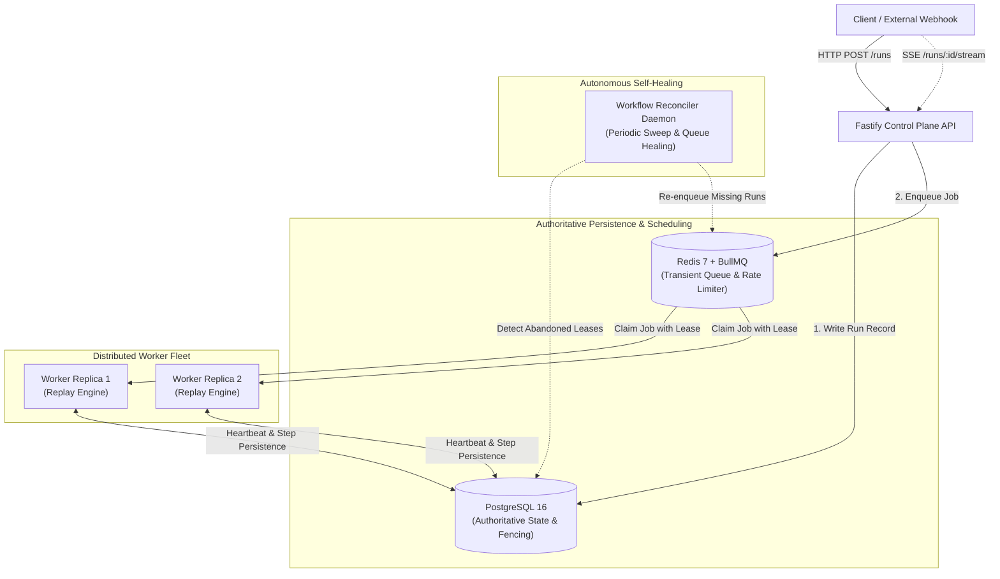

# Durable Workflow Execution Platform

[](https://github.com/starsnipe407/Durable-Workflow-Execution-Platform)
[](https://github.com/starsnipe407/Durable-Workflow-Execution-Platform/actions/workflows/ci.yml)
[](https://opensource.org/licenses/MIT)
[](https://www.typescriptlang.org/)
[](https://www.postgresql.org/)
[](https://redis.io/)
[](https://turbo.build/)

> **GitHub Repository**: [https://github.com/starsnipe407/Durable-Workflow-Execution-Platform](https://github.com/starsnipe407/Durable-Workflow-Execution-Platform)

A production-grade, clean-room TypeScript **Durable Workflow Execution Platform** designed for fault-tolerant orchestration, deterministic replay, and crash resilience. 

Built from scratch without proprietary orchestrator dependencies, it implements enterprise-grade durable primitives—step memoization, distributed transactional fencing, multi-tenant concurrency limits, real-time Server-Sent Events (SSE) telemetry, and self-healing queue reconciliation.

---

## ⚡ Executive Performance & Resilience Highlights

All benchmarks executed against real Docker PostgreSQL 16 & Redis 7 services on a 24-core Intel Core Ultra 9 / 32 GB RAM host:

- 🚀 **High Throughput Scaling**: Scales to **337.6+ workflows/sec** (**1,350+ steps/sec**) across worker replicas while sustaining sub-second queue latency.
- 🛡️ **Zero-Loss Queue Reconstruction**: Reconstructed **10,000 pending workflow runs in 3,347ms** (~2,987 workflows/sec) following catastrophic Redis `FLUSHALL`, verifying **0 lost runs and 0 duplicate executions**.
- 💥 **Crash Recovery Under Real `SIGKILL`**: Mid-execution process termination recovered across lease TTLs (2s–30s) with **0 duplicate executions on memoized steps**.
- 🔒 **Distributed Transactional Fencing**: Zombie workers delayed past lease expiration are guaranteed **100% rejection** via monotonic attempt version checks (`StaleAttemptError`).
- 🌊 **Offered Load Saturation Absorption**: Absorbed offered loads up to **200 req/s** with a maximum queue depth of 16 and sub-8ms queue latency without unbounded buffer inflation.
- 🔄 **Deterministic Exponential Retry Backoff**: Handles transient step failures across configured retry matrices with zero orphaned state.

---

## 🏗️ System Architecture

The platform separates the **control plane** (Fastify HTTP/SSE API), **distributed scheduling** (Redis + BullMQ), **execution plane** (Worker Daemons with deterministic replay), and **authoritative state** (PostgreSQL 16).



---

## 🛡️ Core Durability Guarantees

### 1. Deterministic Replay & Step Memoization
Workflow functions execute as standard TypeScript code. Step invocations (`step.run(...)`) execute once and persist their return value to PostgreSQL. If a worker crashes mid-workflow, a replacement worker replays the workflow from the beginning: previously completed steps return cached results instantly without re-executing side effects.

### 2. Distributed Fencing & Zombie Prevention
Every step attempt generates a cryptographically random attempt token and increments monotonic versioning in PostgreSQL. If a worker stalls (e.g. network partition or stop-the-world GC pause) and its lease expires, the Reconciler marks the attempt abandoned. If the zombie worker wakes up and attempts to commit its result, PostgreSQL enforces transactional fencing and throws `StaleAttemptError`, discarding the stale write.

### 3. Self-Healing Reconciler (Redis Destruction Resilience)
Redis is treated as an ephemeral scheduler, while PostgreSQL remains the single source of truth. If Redis experiences catastrophic data loss or crashes (`FLUSHALL`), the background `WorkflowReconciler` daemon continuously inspects pending database runs and transparently reconstructs the BullMQ queues with idempotency keys.

### 4. Parallel Steps with Sibling Isolation
Steps wrapped in `Promise.all` execute concurrently with isolated database attempt records. If one parallel branch fails or triggers retry backoff, sibling branches proceed uncorrupted.

---

## 📊 Standardized Benchmark Suite

Full reproducible benchmark reports are stored in [`benchmarks/results/`](./benchmarks/results/).

### 1. Horizontal Worker Scaling (1K Workflows × 3 Repetitions)

| Replicas | Concurrency | Completed Workflows | Median Workflows/Sec | Steps/Sec | P50 Latency (ms) | P95 Latency (ms) | Queue P95 (ms) |
| :---: | :---: | :---: | :---: | :---: | :---: | :---: | :---: |
| **1** | 8 | 3,000 | 160.12 | 640.48 | 3,148 ms | 5,739 ms | 5,680 ms |
| **2** | 8 | 3,000 | 270.95 | 1,083.80 | 1,830 ms | 3,271 ms | 3,207 ms |
| **4** | 8 | 3,000 | **337.65** | **1,350.60** | 1,417 ms | 2,520 ms | 2,426 ms |
| **8** | 8 | 3,000 | 325.71 | 1,302.84 | 1,451 ms | 2,413 ms | 2,234 ms |

### 2. Multi-Tier Redis Reconstruction (Catastrophic `FLUSHALL`)

| Runs Ingested | Destruction Event | Reconstruction Time | Requeue Rate | Lost Runs | Duplicate Runs | Integrity Status |
| :---: | :---: | :---: | :---: | :---: | :---: | :---: |
| **100** | `redis.flushall()` | 65.73 ms | 1,521 wf/s | **0** | **0** | ✅ 100% Recovered |
| **1,000** | `redis.flushall()` | 336.85 ms | 2,968 wf/s | **0** | **0** | ✅ 100% Recovered |
| **5,000** | `redis.flushall()` | 1,639.10 ms | 3,050 wf/s | **0** | **0** | ✅ 100% Recovered |
| **10,000** | `redis.flushall()` | **3,347.82 ms** | **2,987 wf/s** | **0** | **0** | ✅ 100% Recovered |

### 3. Crash Recovery Latency vs Lease TTL (Real `SIGKILL`)

Interrupted mid-step via genuine `process.kill(pid, 'SIGKILL')` and recovered by independent replacement workers:

| Lease TTL | Time To Abandoned | Full Recovery Latency | Duplicate Step Invocations | Verification |
| :---: | :---: | :---: | :---: | :---: |
| **2,000 ms** | 2,242 ms | **2,676 ms** | **0** | ✅ Exact Recovery |
| **5,000 ms** | 5,225 ms | **5,664 ms** | **0** | ✅ Exact Recovery |
| **10,000 ms** | 10,213 ms | **10,656 ms** | **0** | ✅ Exact Recovery |
| **30,000 ms** | 30,210 ms | **30,603 ms** | **0** | ✅ Exact Recovery |

---

## 💻 Workflow Authoring SDK

Define resilient workflows with simple TypeScript syntax. Below is an excerpt from the [Order Processing Example](./examples/order-processing):

```typescript
import { defineWorkflow } from "@durable/workflow-sdk";

export const processOrderWorkflow = defineWorkflow(
  { name: "process-order", version: "1.0.0" },
  async ({ input, step }) => {
    // Step 1: Validation
    await step.run("validate-cart", { retries: 0 }, async () => {
      if (!input.items.length) throw new Error("Cart is empty");
    });

    // Step 2: External Idempotent Payment
    const payment = await step.run(
      "charge-payment",
      { retries: 3, backoff: "exponential" },
      async () => {
        return await paymentGateway.charge({
          amount: input.totalAmount,
          idempotencyKey: step.idempotencyKey // Deterministic step key
        });
      }
    );

    // Step 3: Concurrent Parallel Tasks with Sibling Isolation
    const [email, invoice, crm] = await Promise.all([
      step.run("send-confirmation-email", async () => emailService.send(input.customerEmail)),
      step.run("generate-invoice", async () => invoiceService.create(payment.chargeId)),
      step.run("sync-crm", async () => crmService.upsertCustomer(input.customerId))
    ]);

    return { status: "FULFILLED", chargeId: payment.chargeId };
  }
);
```

---

## 🖥️ Real-Time Observability Dashboard

A Next.js 16 (App Router + React 19) observability dashboard providing:
- **Live SSE Event Streaming**: Real-time progress indicators showing steps transitioning from `PENDING` → `RUNNING` → `COMPLETED`.
- **DAG Execution Timeline**: Visual timeline with execution durations, retry attempt counts, and memoized cache indicators.
- **Workflow State Inspector**: Drill into raw inputs, outputs, error stack traces, and database attempt IDs.

```bash
pnpm --filter @durable/dashboard dev
# Accessible at http://localhost:3001
```

---

## 📦 Monorepo Structure

```text
.
├── apps/
│   ├── api/             # Fastify HTTP Control Plane & Server-Sent Events (SSE)
│   ├── worker/          # Distributed BullMQ Worker Daemon & Replay Engine
│   ├── reconciler/      # Autonomous Lease Sweeper & Queue Reconstruction Daemon
│   └── dashboard/       # Next.js 16 Real-Time Observability Web UI
├── packages/
│   ├── workflow-sdk/    # Clean-room Developer SDK (defineWorkflow, step.run)
│   ├── client/          # Isomorphic Client Library for HTTP & SSE consumption
│   ├── database/        # Prisma Schema, Migrations, & Fenced PostgreSQL Access
│   └── shared/          # Shared Zod Schemas, Domain Enums, & Contract Types
├── examples/
│   └── order-processing/# E-commerce Order Fulfillment Example App & CLI
└── benchmarks/          # Standardized 7-Dimension Performance & Chaos Benchmark Suite
```

---

## 🚀 Quickstart

### Prerequisites
- [Node.js](https://nodejs.org/) v22+
- [pnpm](https://pnpm.io/) v10+
- [Docker](https://www.docker.com/) & Docker Compose

### 1. Clone & Install Dependencies
```bash
git clone https://github.com/starsnipe407/Durable-Workflow-Execution-Platform.git
cd Durable-Workflow-Execution-Platform
pnpm install
```

### 2. Start PostgreSQL & Redis
```bash
# Spins up PostgreSQL 16 on :5433 and Redis 7 on :6380
pnpm db:up

# Run Prisma schema migrations
pnpm --filter @durable/database exec prisma migrate deploy
```

### 3. Run the Benchmark Suite
```bash
# Run Quick Verification Profile (~17 seconds)
pnpm bench:quick

# Run Official High-Load 1K/10K CV Artifact Benchmark (~3 minutes)
pnpm bench:full
```

### 4. Run Example Order Processing CLI
```bash
# Run live e-commerce pipeline with interactive SSE telemetry output
pnpm --filter @example/order-processing start
```

### 5. Run Test Suites
```bash
# Run all monorepo unit, integration, and chaos test suites
pnpm test
```

---

## 📜 License

Distributed under the [MIT License](./LICENSE). Copyright © 2026 [Aztrek](https://github.com/starsnipe407).
